


<!-- TOP_REPOS:START -->
<a href="https://github.com/AhmetCanArslan/ShizuWall"></a>
<a href="https://github.com/AhmetCanArslan/CustomAnimator"></a>
<a href="https://github.com/AhmetCanArslan/TextGrab"></a>
<a href="https://github.com/AhmetCanArslan/HiddenAlarmRevealer"></a>
<a href="https://github.com/AhmetCanArslan/CloneCat"></a>
<a href="https://github.com/AhmetCanArslan/NotificationTester"></a>
<a href="https://github.com/AhmetCanArslan/NDNA"></a>
<a href="https://github.com/AhmetCanArslan/GithubFollowersTelegramBot"></a>
<a href="https://github.com/AhmetCanArslan/NetworkChecker"></a>
<a href="https://github.com/AhmetCanArslan/linux-scripts"></a>
<!-- TOP_REPOS:END -->
